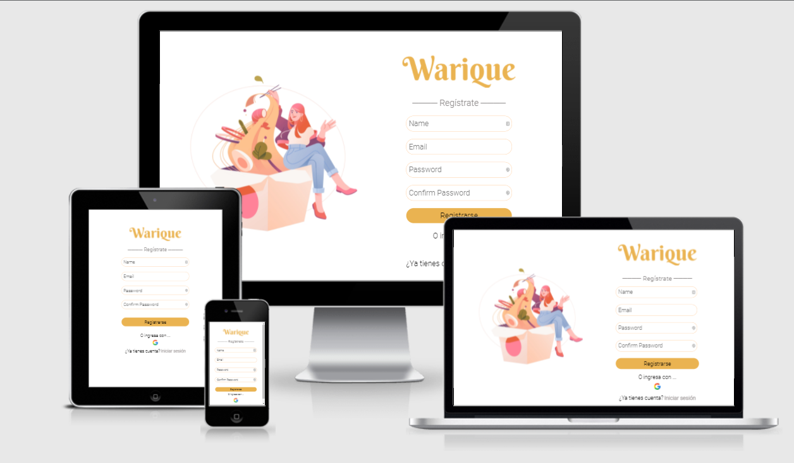
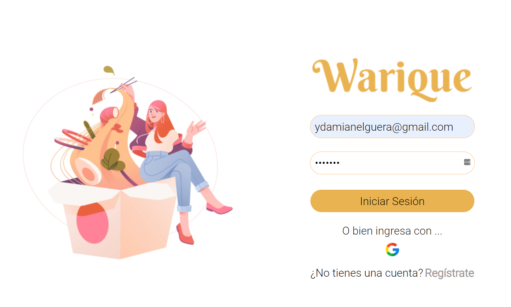
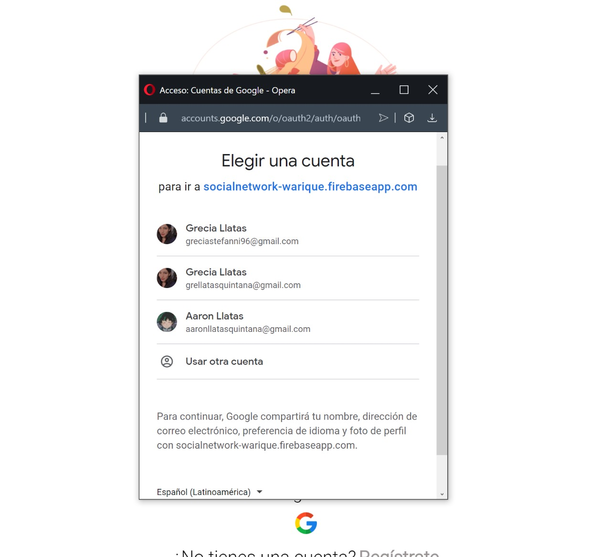
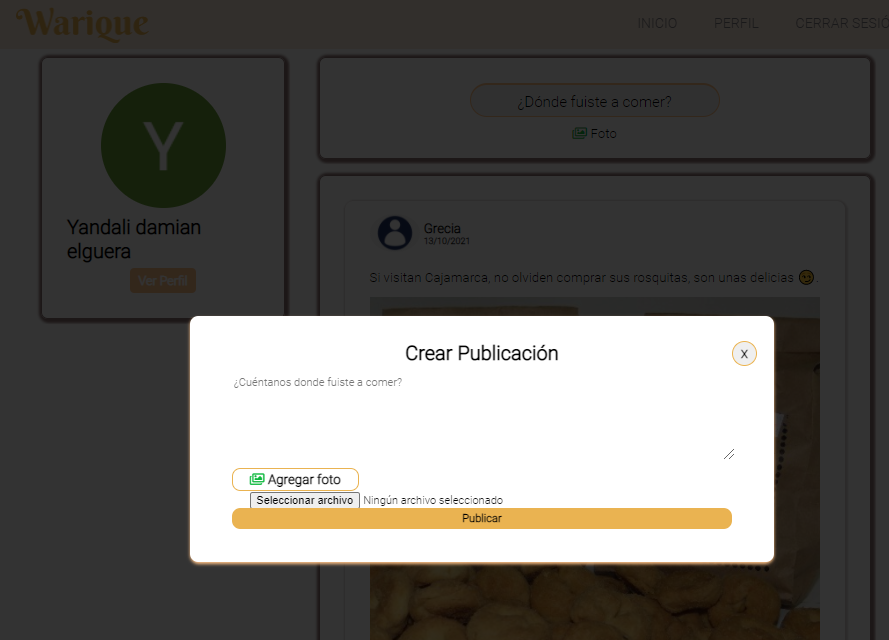
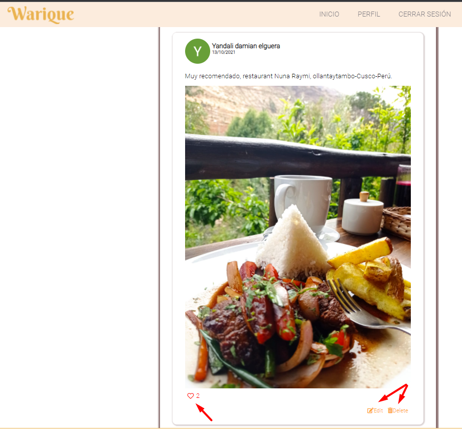
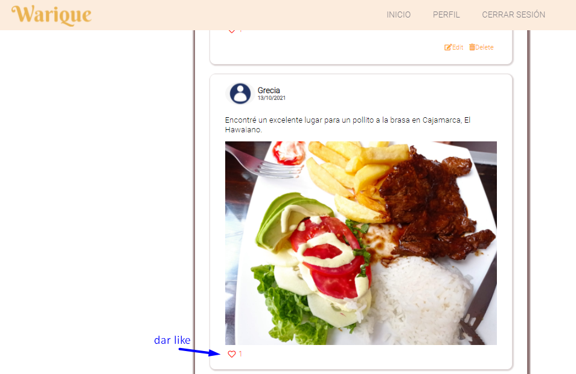
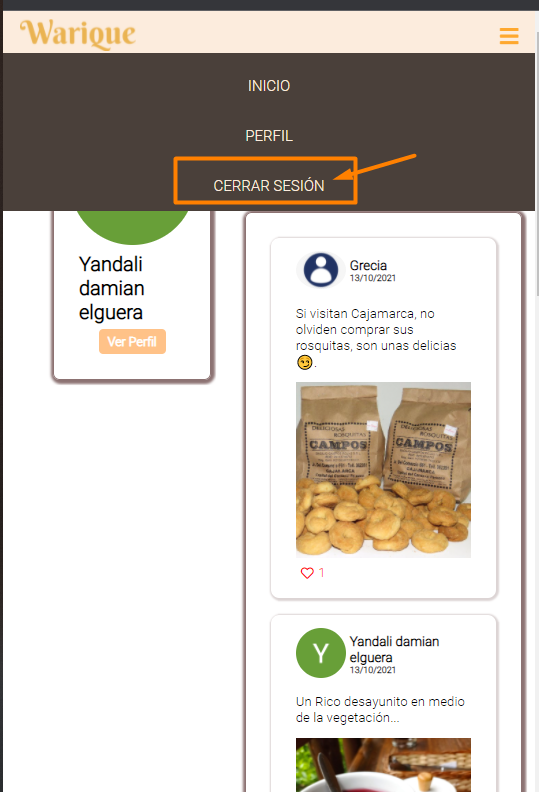
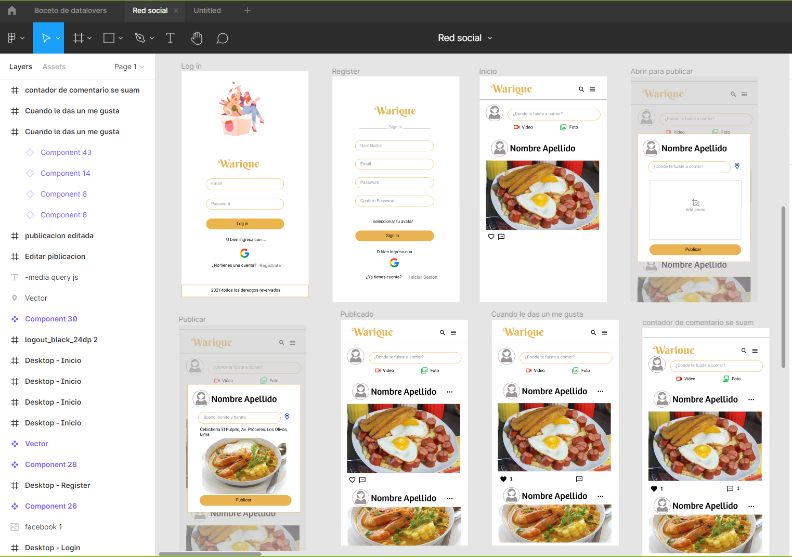

# Red Social "Warique"

## Índice

* [1. Preámbulo](#1-preámbulo)
* [2. Resumen del proyecto](#2-resumen-del-proyecto)
* [3. Objetivos de aprendizaje](#3-objetivos-de-aprendizaje)
* [4. Historias de Usuario](#4-historias-de-usuario)
* [5. Diseño de la Interfaz de Usuario](#5-diseño-de-la-interfaz-de-usuario)
* [6. Agradecimiento 💛](#6-agradecimiento-💛)

## 1. Preámbulo

Instagram, Snapchat, Twitter, Facebook, Twitch, Linkedin, etc. Las redes
sociales han invadido nuestras vidas. Las amamos u odiamos, y muchos no podemos
vivir sin ellas.

Hay redes sociales de todo tipo y para todo tipo de intereses.

## 2. Resumen del proyecto

Warique es una red social, dirigido a las personas amantes de la comida, aqui podran postear sus platillos e indicar que tan buena fue y donde es el lugar, de esta manera en caso uno viaja por cualquier parte del Perú, encontrará recomendaciones de restaurantes de los distintos departamentos.

## 3. Objetivos de aprendizaje

Reflexiona y luego marca los objetivos que has llegado a entender y aplicar en tu proyecto. Piensa en eso al decidir tu estrategia de trabajo.

### HTML

- [✔️] **Uso de HTML semántico**

  

Links

  * [HTML semántico](https://curriculum.laboratoria.la/es/topics/html/02-html5/02-semantic-html)
  * [Semantics - MDN Web Docs Glossary](https://developer.mozilla.org/en-US/docs/Glossary/Semantics#Semantics_in_HTML)

### CSS

- [✔️] **Uso de selectores de CSS**

  

Links

  * [Intro a CSS](https://curriculum.laboratoria.la/es/topics/css/01-css/01-intro-css)
  * [CSS Selectors - MDN](https://developer.mozilla.org/es/docs/Web/CSS/CSS_Selectors)

- [✔️] **Modelo de caja (box model): borde, margen, padding**

  

Links

  * [Box Model & Display](https://curriculum.laboratoria.la/es/topics/css/01-css/02-boxmodel-and-display)
  * [The box model - MDN](https://developer.mozilla.org/en-US/docs/Learn/CSS/Building_blocks/The_box_model)
  * [Introduction to the CSS box model - MDN](https://developer.mozilla.org/en-US/docs/Web/CSS/CSS_Box_Model/Introduction_to_the_CSS_box_model)
  * [CSS display - MDN](https://developer.mozilla.org/pt-BR/docs/Web/CSS/display)
  * [display - CSS Tricks](https://css-tricks.com/almanac/properties/d/display/)

- [✔️] **Uso de flexbox en CSS**

  

Links

  * [A Complete Guide to Flexbox - CSS Tricks](https://css-tricks.com/snippets/css/a-guide-to-flexbox/)
  * [Flexbox Froggy](https://flexboxfroggy.com/#es)
  * [Flexbox - MDN](https://developer.mozilla.org/en-US/docs/Learn/CSS/CSS_layout/Flexbox)

- [ ] **Uso de CSS Grid Layout**

  

Links

  * [A Complete Guide to Grid - CSS Tricks](https://css-tricks.com/snippets/css/complete-guide-grid/)
  * [Grids - MDN](https://developer.mozilla.org/en-US/docs/Learn/CSS/CSS_layout/Grids)

### Web APIs

- [✔️] **Uso de selectores del DOM**

  

Links

  * [Manipulación del DOM](https://curriculum.laboratoria.la/es/topics/browser/02-dom/03-1-dom-methods-selection)
  * [Introducción al DOM - MDN](https://developer.mozilla.org/es/docs/Web/API/Document_Object_Model/Introduction)
  * [Localizando elementos DOM usando selectores - MDN](https://developer.mozilla.org/es/docs/Web/API/Document_object_model/Locating_DOM_elements_using_selectors)

- [✔️] **Manejo de eventos del DOM (listeners, propagación, delegación)**

  

Links

  * [Introducción a eventos - MDN](https://developer.mozilla.org/es/docs/Learn/JavaScript/Building_blocks/Events)
  * [EventTarget.addEventListener() - MDN](https://developer.mozilla.org/es/docs/Web/API/EventTarget/addEventListener)
  * [EventTarget.removeEventListener() - MDN](https://developer.mozilla.org/es/docs/Web/API/EventTarget/removeEventListener)
  * [El objeto Event](https://developer.mozilla.org/es/docs/Web/API/Event)

- [✔️] **Manipulación dinámica del DOM**

  

Links

  * [Introducción al DOM](https://developer.mozilla.org/es/docs/Web/API/Document_Object_Model/Introduction)
  * [Node.appendChild() - MDN](https://developer.mozilla.org/es/docs/Web/API/Node/appendChild)
  * [Document.createElement() - MDN](https://developer.mozilla.org/es/docs/Web/API/Document/createElement)
  * [Document.createTextNode()](https://developer.mozilla.org/es/docs/Web/API/Document/createTextNode)
  * [Element.innerHTML - MDN](https://developer.mozilla.org/es/docs/Web/API/Element/innerHTML)
  * [Node.textContent - MDN](https://developer.mozilla.org/es/docs/Web/API/Node/textContent)

- [✔️] **Ruteado (History API, evento hashchange, window.location)**

  

Links

  * [Manipulando el historial del navegador - MDN](https://developer.mozilla.org/es/docs/DOM/Manipulando_el_historial_del_navegador)

### JavaScript

- [✔️] **Arrays (arreglos)**

  

Links

  * [Arreglos](https://curriculum.laboratoria.la/es/topics/javascript/04-arrays)
  * [Array - MDN](https://developer.mozilla.org/es/docs/Web/JavaScript/Reference/Global_Objects/Array/)
  * [Array.prototype.sort() - MDN](https://developer.mozilla.org/es/docs/Web/JavaScript/Reference/Global_Objects/Array/sort)
  * [Array.prototype.forEach() - MDN](https://developer.mozilla.org/es/docs/Web/JavaScript/Reference/Global_Objects/Array/forEach)
  * [Array.prototype.map() - MDN](https://developer.mozilla.org/es/docs/Web/JavaScript/Reference/Global_Objects/Array/map)
  * [Array.prototype.filter() - MDN](https://developer.mozilla.org/es/docs/Web/JavaScript/Reference/Global_Objects/Array/filter)
  * [Array.prototype.reduce() - MDN](https://developer.mozilla.org/es/docs/Web/JavaScript/Reference/Global_Objects/Array/Reduce)

- [✔️] **Objetos (key, value)**

  

Links

  * [Objetos en JavaScript](https://curriculum.laboratoria.la/es/topics/javascript/05-objects/01-objects)

- [✔️] **Diferenciar entre tipos de datos primitivos y no primitivos**

- [✔️] **Variables (declaración, asignación, ámbito)**

  

Links

  * [Valores, tipos de datos y operadores](https://curriculum.laboratoria.la/es/topics/javascript/01-basics/01-values-variables-and-types)
  * [Variables](https://curriculum.laboratoria.la/es/topics/javascript/01-basics/02-variables)

- [✔️] **Uso de condicionales (if-else, switch, operador ternario, lógica booleana)**

  

Links

  * [Estructuras condicionales y repetitivas](https://curriculum.laboratoria.la/es/topics/javascript/02-flow-control/01-conditionals-and-loops)
  * [Tomando decisiones en tu código — condicionales - MDN](https://developer.mozilla.org/es/docs/Learn/JavaScript/Building_blocks/conditionals)

- [✔️] **Uso de bucles/ciclos (while, for, for..of)**

  

Links

  * [Bucles (Loops)](https://curriculum.laboratoria.la/es/topics/javascript/02-flow-control/02-loops)
  * [Bucles e iteración - MDN](https://developer.mozilla.org/es/docs/Web/JavaScript/Guide/Loops_and_iteration)

- [✔️] **Funciones (params, args, return)**

  

Links

  * [Funciones (control de flujo)](https://curriculum.laboratoria.la/es/topics/javascript/02-flow-control/03-functions)
  * [Funciones clásicas](https://curriculum.laboratoria.la/es/topics/javascript/03-functions/01-classic)
  * [Arrow Functions](https://curriculum.laboratoria.la/es/topics/javascript/03-functions/02-arrow)
  * [Funciones — bloques de código reutilizables - MDN](https://developer.mozilla.org/es/docs/Learn/JavaScript/Building_blocks/Functions)

- [✔️] **Pruebas unitarias (unit tests)**

  

Links

  * [Empezando con Jest - Documentación oficial](https://jestjs.io/docs/es-ES/getting-started)

- [✔️] **Pruebas asíncronas**

  

Links

  * [Tests de código asincrónico con Jest - Documentación oficial](https://jestjs.io/docs/es-ES/asynchronous)

- [✔️] **Uso de mocks y espías**

  

Links

  * [Manual Mocks con Jest - Documentación oficial](https://jestjs.io/docs/es-ES/manual-mocks)

- [✔️] **Módulos de ECMAScript (ES Modules)**

  

Links

  * [import - MDN](https://developer.mozilla.org/es/docs/Web/JavaScript/Reference/Statements/import)
  * [export - MDN](https://developer.mozilla.org/es/docs/Web/JavaScript/Reference/Statements/export)

- [✔️] **Uso de linter (ESLINT)**

- [✔️] **Uso de identificadores descriptivos (Nomenclatura y Semántica)**

- [✔️] **Diferenciar entre expresiones (expressions) y sentencias (statements)**

- [✔️] **Callbacks**

  

Links

  * [Función Callback - MDN](https://developer.mozilla.org/es/docs/Glossary/Callback_function)

- [✔️] **Promesas**

  

Links

  * [Promise - MDN](https://developer.mozilla.org/es/docs/Web/JavaScript/Reference/Global_Objects/Promise)
  * [How to Write a JavaScript Promise - freecodecamp (en inglés)](https://www.freecodecamp.org/news/how-to-write-a-javascript-promise-4ed8d44292b8/)

### Control de Versiones (Git y GitHub)

- [✔️] **Git: Instalación y configuración**

- [✔️] **Git: Control de versiones con git (init, clone, add, commit, status, push, pull, remote)**

- [✔️] **Git: Integración de cambios entre ramas (branch, checkout, fetch, merge, reset, rebase, tag)**

- [ ] **GitHub: Creación de cuenta y repos, configuración de llaves SSH**

- [✔️] **GitHub: Despliegue con GitHub Pages**

  

Links

  * [Sitio oficial de GitHub Pages](https://pages.github.com/)

- [✔️] **GitHub: Colaboración en Github (branches | forks | pull requests | code review | tags)**

- [✔️] **GitHub: Organización en Github (projects | issues | labels | milestones | releases)**

### UX (User eXperience)

- [✔️] **Diseñar la aplicación pensando en y entendiendo al usuario**

- [✔️] **Crear prototipos para obtener feedback e iterar**

- [✔️] **Aplicar los principios de diseño visual (contraste, alineación, jerarquía)**

- [✔️] **Planear y ejecutar tests de usabilidad**

### Firebase

- [✔️] **Firebase Auth**

  

Links

  * [Primeros pasos con Firebase Authentication en sitios web - Documentación oficial](https://firebase.google.com/docs/auth/web/start?hl=es)
  * [Administra usuarios en Firebase (onAuthStateChanged)](https://firebase.google.com/docs/auth/web/manage-users?hl=es#get_the_currently_signed-in_user)

- [✔️] **Firestore**

  

Links

  * [Firestore - Documentación oficial](https://firebase.google.com/docs/firestore?hl=es)
  * [Reglas de seguridad de Firestore - Documentación oficial](https://firebase.google.com/docs/rules?hl=es)
  * [Obtén actualizaciones en tiempo real con Cloud Firestore - Documentación oficial](https://firebase.google.com/docs/firestore/query-data/listen?hl=es)

## 4. Historias de Usuario
### HU001: Registrarme como usuario nuevo
Como usuario quiero poder logearme y registrarme con un usuario y contraseña.

### HU002: Iniciar sesión(Email y google)
Como usuario nuevo tengo que crear una cuenta con correo electrónico y contraseña (válidos) para iniciar sesión.

##

### HU003: Postear
Como usuario logeado debo poder publicar, visualizar, modificar y eliminar una publicación (actividades siempre y cuando sea mio).

### HU004:Like/Me gusta
Como usuario podre dar me gusta a las publicaciones de todos y como tambien de los mios.

### HU005:Cerrar sesión
Como usuario podre salir de mi cuenta cerrando sesión.

## 5. Diseño de la Interfaz de Usuario
### 5.1 prototipado en alta fidelidad

### 5.5 Responsive

Debe verse bien en dispositivos de pantallas grandes
(computadoras/es, laptops, etc.) y pequeñas (_tablets_, celulares, etc.).

* Vista mobile y Vista Desktop

 
 ## 6. Agradecimiento 💛

 Agradecemos a toda la familia Laboratorians (coaches y compañeras), por la paciencia y apoyo para poder culminar y seguir con el proyecto.
